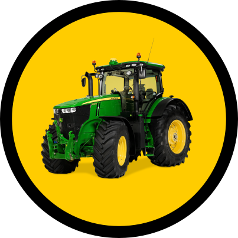

# Truck Factory

### Descripción

Desarrollo de una aplicación web orientada al control de afluencia de camiones 🚚 en una planta industrial 🏭

## Como clonar el repositorio

    git clone --recursive https://github.com/CampusDual/2023-BIN-1-G2

La opción recursive también incluirá el submódulo truck_moves_simulator, que contiene el programa para cargar los datos iniciales

## Como cargar datos iniciales

Prerequisitos:

- Clonar el repositorio con los submódulos

- Persistir en la base de datos la estructura de los DAO pertenecientes al backend en la siguiente [carpeta](./backend/hr-model/src/main/java/com/ontimize/hr/model/core/dao/)

---

1. Iniciar el backend y la base de datos
2. Editar el archivo .env de la carpeta truck_moves_simulator
        
        POST_URL=http://localhost:33333/registers/makeRequest
        USER=demo
        PASS=demouser

3. Ejecutar el script make_request.js

        node make_request.js

## Desarrollado con 🛠️

#### Back-end: 👷‍♂️

-   [OpenJDK 11](https://adoptopenjdk.net/)  - Open Java

-   [Maven](https://maven.apache.org/)  - Dependencies Management
-   [Spring](https://spring.io/)  - Framework
-   [Ontimize Boot](https://github.com/ontimize/basicproject)  - Framework

-   [PostgreSQL](https://www.postgresql.org/)  - Base de Datos

#### Front-end: 💻

-   [Node.js](http://nodejs.org/)  - Runtime Environment
-   [Npm](https://www.npmjs.com/)  - Package Management
-   [Angular](https://angular.io/)  - Framework
-   [Ontimize Web](https://github.com/ontimize/basicproject)  - Framework

## Autores ✒️

* [**Pedro Costas**](https://www.linkedin.com/in/pedro-costas-ferrad%C3%A1s/)
* [**Mauro Vidal**]()
* [**Borja Miguens**]()
* [**Gabriel Costas**]()